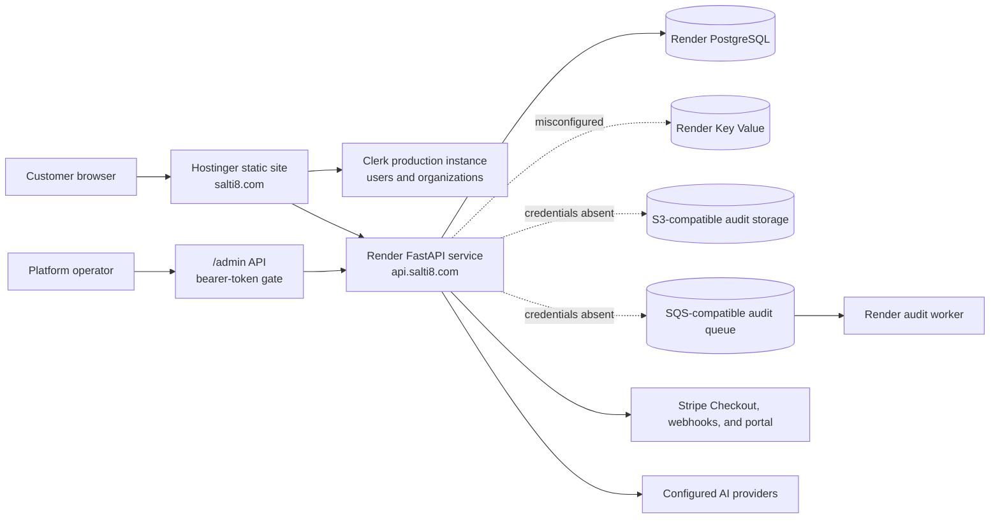
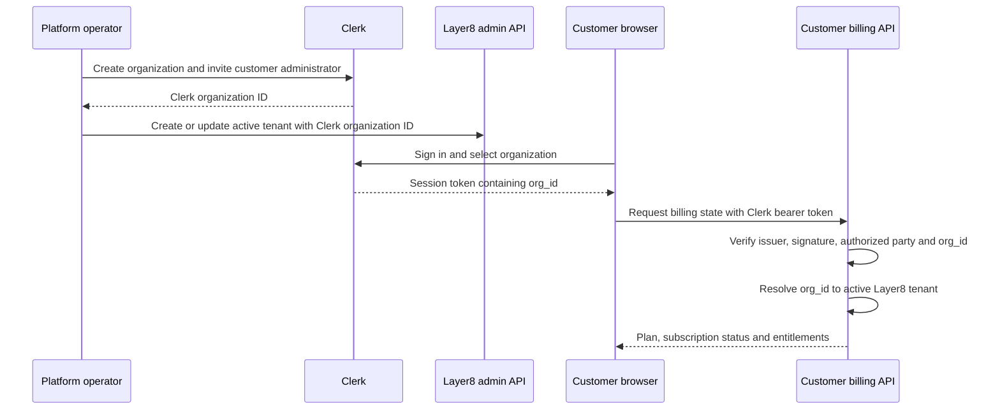

# Layer8 Adaptive deployed-build blueprint

**System:** Layer8 Adaptive by SALTI8  
**Environment:** Production  
**Verified:** July 28, 2026 (America/Denver)  
**Repository:** `robs46859-eng/layer8` on `main`  
**Verified revision:** `ed17ed952e82a71041eb768b92b617fcae1d8fc0`

This document is the point-in-time blueprint for the system that is deployed
today. `PLATFORM_BUILD_PLAN.md` remains the target architecture and roadmap.
When the target and the deployed system differ, this document describes the
current production boundary.

## 1. Verification summary

| Stage | Result | Evidence |
| --- | --- | --- |
| Local checkout matches `origin/main` | PASS | `HEAD` and `origin/main` both resolve to `ed17ed9` after fetch |
| Public web home | PASS | `https://salti8.com/` returned `200` |
| Customer sign-in route | PASS | `https://salti8.com/sign-in/` returned `200`; Clerk session handling is active |
| Billing route | PASS | `https://salti8.com/app/billing/` returned `200` |
| API liveness | PASS | `https://api.salti8.com/healthz` returned `200` with `{"status":"ok"}` |
| API readiness | **FAIL** | `https://api.salti8.com/readyz` returned `503` |
| PostgreSQL readiness | PASS | Production readiness check reported PostgreSQL `ok` |
| Redis readiness | **FAIL** | Production attempted `localhost:6379` and received connection refused |
| Object-storage readiness | **FAIL** | Production reported missing AWS-compatible credentials |
| Queue readiness | **FAIL** | Production reported missing AWS-compatible credentials |
| Customer auth boundary | PASS | Anonymous customer billing request returned the expected `401` |
| Platform admin boundary | **FAIL / unconfigured** | Anonymous admin request returned `503` with `admin auth is not configured` |
| Clerk organization access | **BLOCKED** | Authenticated browser session reached Billing but displayed `Organization required` |

The public site is live, but the complete deployed product is not operationally
ready. A `200` liveness response proves that the API process runs; the `503`
readiness response proves that required infrastructure is not connected.

## 2. Deployed topology

## 3. Deployment units

| Unit | Source | Runtime | Current responsibility |
| --- | --- | --- | --- |
| Public/customer web | `apps/web` | Static Next.js export on Hostinger | Marketing, Clerk sign-in/sign-up, organization selection, billing and entitlement UI |
| API | `app` | FastAPI on Render | Customer token validation, billing, webhooks, admin API, inference and spatial routes |
| Worker | `app/workers/tasks.py` | Render background worker | Audit queue consumption and archive delivery |
| Database | SQLAlchemy + Alembic | Render PostgreSQL | Tenants, API keys, billing state, pilot applications and operational records |
| Cache/rate limit | Redis services | Render Key Value | Tenant-aware cache and rate-limit state |
| Audit storage | S3-compatible service | External managed service | Durable audit payload storage |
| Audit queue | SQS-compatible service | External managed service | Asynchronous audit delivery |
| Identity | Clerk | Hosted service | User sessions and organization membership |
| Billing | Stripe | Hosted service | Checkout, subscriptions, entitlements, invoices and customer portal |

## 4. Identity and access boundaries

Production has two independent administrative concepts.

### Customer organization administration

Clerk controls customer identity, organization membership and the active
organization claim. A customer session must contain `org_id`. The API maps that
Clerk organization ID to exactly one active Layer8 tenant.

This path grants access to customer billing and entitlement views. It does not
grant access to the platform `/admin` API.

### Platform administration

The current platform control plane is API-only. Requests under `/admin` require
the bearer token configured in `ADMIN_API_TOKEN`. Clerk users and Clerk
organization roles are not evaluated by this gate.

There is no deployed website admin console for tenant provisioning, API-key
administration or pilot-application review.

## 5. Customer access chain

A valid user login alone is insufficient. The user must belong to a Clerk
organization, select it, and that organization must be mapped to an active
Layer8 tenant.

## 6. Gated features actually deployed

The authenticated website currently implements:

- Clerk sign-in and sign-up;
- active-organization selection;
- subscription status;
- Stripe Checkout initiation;
- Stripe customer-portal initiation; and
- active-entitlement display.

The target dashboard, playground, integration management, provider management,
tenant administration and audit explorer are not deployed as authenticated web
features. Runtime inference remains API-key gated and entitlement enforced.

## 7. Production configuration contract

### Hostinger public build values

- `NEXT_PUBLIC_SITE_URL=https://salti8.com`
- `NEXT_PUBLIC_CLERK_PUBLISHABLE_KEY`
- `NEXT_PUBLIC_API_URL=https://api.salti8.com`
- public plan labels

Hostinger must not receive Clerk secret keys, Stripe secret keys, the platform
admin token, database credentials, provider secrets or AWS-compatible
credentials.

### Render API values

The API requires:

- PostgreSQL and Redis connection URLs;
- `ADMIN_API_TOKEN`;
- `CLERK_JWT_KEY`, `CLERK_ISSUER` and `CLERK_AUTHORIZED_PARTIES`;
- Stripe secret, webhook, mode and price configuration;
- S3-compatible bucket, endpoint and credentials;
- SQS-compatible queue URL, endpoint and credentials; and
- approved provider keys.

The worker requires the same database and audit-storage/queue identity needed
to consume and archive audit events.

## 8. Release gates

A deployment is acceptable only when all of the following pass:

1. `HEAD` matches the intended immutable revision.
2. Backend lint, tests and compile checks pass.
3. Frontend type check and static production build pass.
4. Required public routes return `200`.
5. `/healthz` returns `200`.
6. `/readyz` returns `200`, with PostgreSQL, Redis, storage and queue all `ok`.
7. Anonymous customer billing returns `401`.
8. Anonymous admin access returns `401`, not `503`; this proves the admin gate
   is configured without exposing its credential.
9. An invited test administrator can select a Clerk organization that maps to
   an active Layer8 tenant.
10. Signed Stripe test-mode webhooks activate only the intended tenant and
    grant the expected entitlements.
11. The audit worker consumes a synthetic event and writes its durable archive.

The current production deployment fails gates 6, 8, 9 and 11. Gate 10 was not
exercised during this read-only verification.

## 9. Recovery order

1. Correct the Render Redis binding so `REDIS_URL` is not the localhost
   default.
2. Configure the S3/SQS-compatible group values and verify the bucket and queue.
3. Configure `ADMIN_API_TOKEN` through Render's secret field.
4. Re-deploy the API and worker, then require `/readyz` to return `200`.
5. Create a Clerk organization and invite the intended administrator.
6. Map that Clerk organization ID to an active Layer8 tenant through the
   protected admin API.
7. Verify the authenticated billing page and Stripe test-mode lifecycle.
8. Verify one audit event from API request through worker archive.

Do not weaken readiness checks or bypass the tenant mapping to make the UI
appear accessible.

## 10. Related sources

- `PLATFORM_BUILD_PLAN.md` — target architecture and roadmap
- `ACCESS_AND_ENTITLEMENT_SPECIFICATION.md` — identity and provisioning rules
- `../runbooks/HOSTINGER_DEPLOYMENT.md` — static web deployment and DNS
- `../runbooks/SEO_AND_INDEXING.md` — canonical URLs, indexing policy, release gate
- `../runbooks/SANDBOX_AND_FIRST_CUSTOMER.md` — first-customer activation
- `../runbooks/STRIPE_LIVE_SETUP.md` — Stripe production configuration
- `../../render.yaml` — Render infrastructure blueprint
