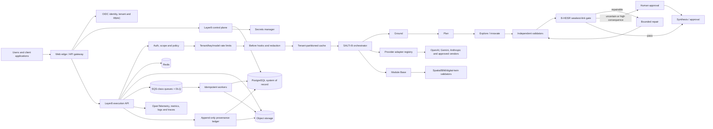

# Layer8 Adaptive Platform

## Build-out architecture and repository plan

**Prepared:** July 28, 2026

**Recommended product name:** Layer8 Adaptive

**Core engine name:** SALTI-B Control Engine

**Recommended repository:** `robs46859-eng/layer8` on `main`

**Planning horizon:** 90 days to pilot-ready, followed by calibrated vertical expansion

---

## 1. Executive decision

Build the new platform on top of the existing `robs46859-eng/layer8` repository on `main`.

Do not create a separate repository for this build unless Layer8 and SALTI-B are later separated into independently owned products with different release, security, or licensing boundaries. Do not create a long-lived feature branch. The current repository is already the right substrate:

- It contains the Layer8 multi-tenant FastAPI gateway.
- Its request path already follows the correct secure ordering.
- It has PostgreSQL models and Alembic migrations.
- It has Redis cache and rate-limit implementations.
- It has S3/MinIO and SQS-compatible audit infrastructure.
- It has tenant and API-key administration.
- It has OpenAI and Gemini adapters.
- It has spatial `observe`, `plan`, and `verify` endpoints.
- It has Docker, local infrastructure, CI, release automation, staging/production deployment files, and a tagged `v0.1.0`.
- Its current 21-test suite passes.
- Its recent spatial work has already been merged into `main`.

A new repository would create duplicate infrastructure, split provenance, and force the team to reconcile two control planes. A new branch would add no architectural value and conflicts with the requested main-only approach.

The correct shape is a monorepo: retain the Python backend and add the production frontend, shared contracts, product documentation, and deployment assets alongside it.

Two repository-governance issues must be resolved before broader reuse: the public repository currently has no license file, and the latest `main` GitHub Actions run fails during lint, so its test and image-publishing steps never run and staging is skipped.

### Repository decision matrix

| Option | Advantages | Costs and risks | Decision |
|---|---|---|---|
| Existing `layer8` on `main` | Preserves history, API, schemas, tests, releases, containers, and deployment work | Requires careful migration of the static frontend and incremental cleanup | **Recommended** |
| New `layer8-platform` repository | Clean starting layout | Duplicates the backend, splits audit history, introduces migration and synchronization risk | Do not use now |
| New branch in `layer8` | Conventional review workflow | Explicitly not preferred; unnecessary for a single-owner main-only build | Do not use |

### Main-only operating model

Because direct work on `main` removes the normal pull-request safety gate:

1. Protect `main` against force-push and deletion.
2. Require signed, atomic commits.
3. Run the full local quality gate before every push.
4. Keep each commit independently deployable or safely revertible.
5. Run CI on every push to `main`.
6. Deploy automatically to staging only after CI succeeds.
7. Promote only immutable versioned images to production.
8. Roll back with a forward fix or `git revert`, never history rewriting.

---

## 2. Naming recommendation

### Recommended naming hierarchy

- **Company/platform brand:** Layer8
- **Commercial product:** Layer8 Adaptive
- **Agent controller:** SALTI-B Control Engine
- **Resilience/gating model:** B-HDSR
- **Specialist capability catalog:** Module Base
- **First vertical modules:** Spatial Intelligence, Digital Twins, and Disaster Resilience
- **Repository:** `layer8`
- **Python packages:** `app.layer8`, `app.salti_b`, `app.bhdsr`, `app.modules`
- **Public API host:** `api.<approved-domain>`
- **Web app host:** `app.<approved-domain>`

“Layer8 Adaptive” is the strongest product name because it keeps the existing brand equity, describes the closed-loop behavior, and does not force customers to understand the SALTI-B acronym before understanding the value.

Keep “SALTI-B” as the distinctive engine name. The acronym is currently inconsistent in the source material: some documents use “SATLI” for Smith Agent Temperature Logic Indicator, while the UI and broader platform use “SALTI” or “SALTI-B.” Resolve this in an architecture decision record and glossary before public launch. The code should use one canonical spelling: `salti_b`.

### Other viable names

| Name | Best use | Comment |
|---|---|---|
| Layer8 Govern | Enterprise/compliance positioning | Strong but narrower than the spatial and resilience vision |
| Layer8 Resilience | Infrastructure/disaster vertical | Clear, but may undersell the general AI gateway |
| Layer8 Living Systems | Research and public-sector narrative | Memorable but less obviously a software platform |
| Layer8 Control Plane | Technical developer product | Precise but not differentiated |
| Layer8 Forge | Spatial asset creation | Good module name; too creation-focused for the whole platform |

Domain and trademark clearance should be completed before finalizing the commercial name.

---

## 3. Source-material assessment

### Documents reviewed

The source set establishes a consistent architecture:

- Layer8 is the operational management substrate.
- SALTI-B is the closed-loop control and validation engine.
- B-HDSR is the weakest-link stability and recovery logic.
- Module Base supplies specialist validators and repair operators.
- Vertical products supply workflows, evidence, users, and calibration data.

The strongest repeated principles are:

1. Visual plausibility is not operational validity.
2. Unknowns must not create credited capacity.
3. Critical channels use minimum/weakest-link gates rather than averages.
4. Current condition and persistent damage history are separate.
5. Repair must be reason-coded, bounded, and measured.
6. Human review is mandatory when evidence, calibration, or consequence demands it.
7. Every decision must preserve evidence and provenance.
8. SALTI-B temperature is a controller input, not a physical quantity or correctness guarantee.
9. Physical equations, software quality indexes, and calibrated probabilities must never be conflated.

### Source-quality cautions

- The two Word files are byte-for-byte identical.
- The Word manuscript ends mid-sentence after 282 paragraphs and 10 rendered pages.
- Its table of contents promises chapters 4–15 and appendices that are not present.
- Markdown headings, emphasis, lists, and LaTeX render as literal text in Word.
- The manuscript should be treated as an incomplete research draft.
- Some documents describe “nowcasting” as two hours while another uses a six-hour window. The product must store forecast horizon as an explicit, domain-specific parameter rather than hard-code either definition.
- The documents correctly warn that B-HDSR is not currently a substitute for licensed engineering. That limitation must appear in policy, UI copy, API metadata, and approval rules.

### Frontend assessment

The supplied frontend contains seven useful page designs:

- Landing
- Dashboard
- Playground
- Integrations
- API Docs
- Pricing
- Sign Up

It also contains a coherent “Industry” design system:

- Barlow Condensed headings and Barlow body text
- technical steel-blue foundation with orange/lavender/yellow product accents
- blueprint cards and registration marks
- light/dark themes
- square geometry and thin Lucide-style icons

The files are design prototypes, not a production application:

- They depend on a generated `DCLogic` runtime.
- Most layout is inline CSS.
- The dashboard data is hard-coded.
- Cascade runs are simulated with timers.
- The safe-zone formulas are local demo arithmetic.
- Signup redirects without creating an identity or tenant.
- Integration buttons do not connect providers.
- The API docs describe endpoints not implemented in the backend.
- There are no real API calls from the product pages.
- Authentication, authorization, billing, accessibility verification, error handling, loading states, and telemetry are incomplete.

The design should be preserved; the runtime and mock behavior should not.

---

## 4. Product boundary

Layer8 Adaptive should be positioned as a governed AI execution and evidence platform, not as a universal autonomous decision-maker.

### Initial product wedge

The first wedge should be:

> Multi-tenant governance, auditability, and closed-loop validation for high-value AI and spatial workflows.

This is stronger than leading with “another model router.” Provider routing is necessary infrastructure, but the differentiated product is:

- explicit cascade definitions;
- evidence-bound steps;
- independent validation;
- bounded repair;
- weakest-link gates;
- human approval;
- immutable provenance;
- configurable policy;
- tenant-aware usage and cost.

### Initial customer profiles

1. AI platform teams that need multi-provider governance and audit.
2. Spatial/3D teams that need deterministic validation around generative output.
3. Digital-twin and BIM teams that need provenance and semantic gates.
4. Disaster-resilience research and public-sector teams that need evidence-bound decision support.

Do not initially claim automated engineering certification, physical safety prediction, or calibrated probability unless a specific model has completed the required validation program.

---

## 5. Target system architecture



### Architectural rule

Layer8 owns execution and governance. SALTI-B owns workflow control. B-HDSR owns gate evaluation. Specialist modules own domain validation. Humans own consequential approval.

These boundaries should be explicit in code and data. Do not put SALTI-B behavior into provider adapters, route handlers, or frontend formulas.

---

## 6. Monorepo layout

Target layout:

```text
layer8/
├── apps/
│   ├── api/                 # Existing FastAPI application, moved incrementally
│   ├── worker/              # Durable async workers and DLQ replay
│   └── web/                 # Production web application
├── packages/
│   ├── ui/                  # Rebuilt Industry design system
│   ├── api-client/          # Generated TypeScript client from OpenAPI
│   ├── contracts/           # JSON Schema/OpenAPI fixtures and event schemas
│   └── config/              # Shared lint, formatting, and TypeScript settings
├── app/                     # Existing Python package during migration
│   ├── api/
│   ├── core/
│   ├── db/
│   ├── providers/
│   ├── services/
│   ├── salti_b/
│   ├── bhdsr/
│   ├── modules/
│   └── workers/
├── alembic/
├── deploy/
│   ├── local/
│   ├── kubernetes/
│   └── observability/
├── docs/
│   ├── architecture/
│   ├── adr/
│   ├── api/
│   ├── product/
│   ├── research/
│   └── runbooks/
├── tests/
│   ├── unit/
│   ├── integration/
│   ├── contract/
│   ├── e2e/
│   └── security/
├── frontend-reference/      # Original .dc.html source retained as design evidence
├── pyproject.toml
├── package.json
├── pnpm-workspace.yaml
└── README.md
```

Do not perform a disruptive package move first. Add `apps/web`, `packages/ui`, and the domain modules while the current `app/` entrypoint remains stable. Move the API only after contracts and deployments can prove equivalence.

---

## 7. Backend architecture

### 7.1 Layer8 control plane

Responsibilities:

- tenants and organizations;
- users, service accounts, memberships, roles, and scopes;
- API-key lifecycle;
- provider accounts and model catalog;
- routing policies;
- cascade definitions and versions;
- module registrations and tenant bindings;
- quotas, plans, entitlements, usage, and billing references;
- approvals and reviewer assignment;
- audit search and export.

The existing global `ADMIN_API_TOKEN` is suitable only for local bootstrap. Replace it with OIDC-backed operator identity and tenant-aware RBAC before exposing the control plane.

Minimum roles:

- `platform_admin`
- `tenant_admin`
- `operator`
- `reviewer`
- `developer`
- `billing_viewer`
- `read_only`

### 7.2 Execution plane

Retain the existing secure ordering:

1. API-key or session authentication
2. tenant and scope resolution
3. policy evaluation
4. distributed rate and quota enforcement
5. before hooks/redaction
6. canonical request and cache lookup
7. route or start cascade
8. provider/module execution
9. cache write where allowed
10. after hooks
11. usage event
12. audit and provenance event
13. response or durable run handle

Every stage must receive a shared execution context:

```text
request_id
trace_id
tenant_id
principal_id
api_key_id
environment
policy_snapshot_id
cascade_definition_version
selected_provider
selected_model
module_versions
data_classification
retention_policy
idempotency_key
```

### 7.3 SALTI-B orchestration

Implement SALTI-B as a durable, versioned state machine rather than a chain of frontend timers.

Recommended states:

```text
CREATED
GROUNDING
PLANNING
EXPLORING
VALIDATING
GATE_EVALUATION
REPAIRING
CONFIDENCE_REVIEW
AWAITING_HUMAN
APPROVED
REJECTED
FAILED
CANCELLED
```

Every transition writes an immutable event. A mutable run projection may be updated for fast reads, but the transition history must remain append-only.

The first production implementation should use:

- PostgreSQL for durable run state and event/outbox records;
- SQS-class queues for step dispatch;
- Redis for locks, rate limits, short-lived coordination, and stream fan-out;
- S3-compatible storage for prompts, images, models, reports, and large evidence blobs;
- idempotent workers with lease/heartbeat, retry policy, and DLQ;
- Server-Sent Events for UI progress, with polling fallback.

Do not introduce a second orchestration platform in the first 90 days. Re-evaluate Temporal or a managed workflow engine only when the job graph, timers, compensation logic, or scale demonstrates that the current queue/outbox design is insufficient.

### 7.4 B-HDSR gate engine

Implement B-HDSR as a deterministic, pure rules package:

- versioned input schema;
- explicit units and normalization method;
- active/inactive channel mask;
- channel criticality;
- nominal capacity/demand source;
- allowance and demand factors;
- margin per channel;
- confidence/evidence metadata;
- governing weakest link;
- pass, fail, repair, or human-review outcome;
- explanation object suitable for UI and audit.

The gate engine must never accept an opaque provider “confidence” as a calibrated probability. Each score must declare:

- `kind`: heuristic, measured, calibrated, or expert;
- `scale`;
- `units`;
- `source`;
- `timestamp`;
- `calibration_version`;
- `uncertainty`;
- `evidence_refs`.

### 7.5 Provider system

Replace the static registry and default-provider selection with a policy-driven provider catalog:

- per-tenant provider accounts;
- credentials stored by secret reference, never plaintext;
- model capability metadata;
- streaming/vision/tool/structured-output support;
- cost and token limits;
- data-residency attributes;
- timeout, retry, and circuit-breaker rules;
- health score and cooldown;
- deterministic fallback order;
- normalized provider errors and usage.

Initial provider order:

1. Harden OpenAI.
2. Harden Gemini.
3. Add Anthropic.
4. Add other vendors only when a pilot requires them.

The integrations page may list future vendors, but the product UI must distinguish `available`, `configured`, `degraded`, and `planned`.

### 7.6 Module Base

Every specialist module implements a versioned contract:

```text
manifest
input schema
output schema
deterministic validators
optional AI proposer
repair reason codes
resource limits
timeout
data classifications
evidence outputs
health check
semantic version
```

Initial modules:

- general text grounding and factual validation;
- spatial observe;
- spatial plan;
- spatial verify;
- topology validation;
- GLB/glTF validation;
- IFC 4.3 semantic validation;
- provenance validator;
- CAP message generation/validation for the disaster vertical.

The existing spatial endpoints currently bypass rate limiting, caching, plugin hooks, audit, and scope enforcement. They should be migrated behind a generalized execution envelope before production.

---

## 8. Core data model

### Identity and control

- `tenants`
- `users`
- `memberships`
- `roles`
- `role_bindings`
- `service_accounts`
- `api_keys`
- `plans`
- `entitlements`

### Providers and policy

- `provider_accounts`
- `provider_models`
- `routing_policies`
- `policy_versions`
- `secret_references`
- `provider_health_events`

### Cascades and execution

- `cascade_definitions`
- `cascade_definition_versions`
- `cascade_runs`
- `cascade_steps`
- `agent_attempts`
- `step_dependencies`
- `idempotency_records`
- `outbox_events`

### Condition, damage, repair, and gates

- `assets`
- `asset_versions`
- `condition_observations`
- `damage_events`
- `repair_actions`
- `repair_attempt_counters`
- `gate_evaluations`
- `gate_channel_results`
- `calibration_sets`
- `human_reviews`
- `approvals`

### Evidence, audit, and usage

- `artifacts`
- `artifact_versions`
- `evidence_links`
- `provenance_events`
- `request_audit`
- `usage_events`
- `usage_rollups`
- `quota_snapshots`
- `cache_manifests`

### Data rules

- Use UUIDv7 or another sortable opaque identifier for public resources.
- Include `tenant_id` on all tenant-owned records, even where inferable through relationships.
- Enforce tenant filtering in repository/service boundaries and database policies where practical.
- Store durable event timestamps in UTC.
- Use a transactional outbox for database-to-queue publication.
- Make audit/provenance records append-only.
- Store large bodies in object storage and retain hashes plus immutable references in PostgreSQL.
- Version every policy, cascade, module contract, normalization, and calibration set used in a decision.

---

## 9. Public API design

### Compatibility API

Retain:

- `POST /v1/proxy/infer`
- `GET /healthz`
- `GET /readyz`

### Cascade API

- `POST /v1/cascades`
- `GET /v1/cascades`
- `POST /v1/cascades/{cascade_id}/versions`
- `GET /v1/cascades/{cascade_id}/versions/{version}`
- `POST /v1/cascade-runs`
- `GET /v1/cascade-runs/{run_id}`
- `POST /v1/cascade-runs/{run_id}/cancel`
- `GET /v1/cascade-runs/{run_id}/events`
- `GET /v1/cascade-runs/{run_id}/provenance`
- `POST /v1/cascade-runs/{run_id}/reviews`
- `POST /v1/cascade-runs/{run_id}/approve`
- `POST /v1/cascade-runs/{run_id}/reject`

### Spatial API

Retain the current conceptual operations, but make them execution-plane jobs:

- `POST /v1/spatial/observations`
- `POST /v1/spatial/plans`
- `POST /v1/spatial/verifications`

For small requests, allow synchronous completion within a strict timeout. Otherwise return `202 Accepted` with a run ID.

### Control-plane API

- tenant, membership, role, and API-key CRUD;
- provider account and model configuration;
- routing-policy versions;
- module registrations/bindings;
- usage, quota, and invoice views;
- audit/provenance search;
- plan and entitlement administration.

### Contract rules

- Generate OpenAPI from FastAPI.
- Generate the frontend TypeScript client from OpenAPI.
- Use JSON Schema for cascade/module payloads.
- Return a stable error envelope with `code`, `message`, `request_id`, `details`, and `retryable`.
- Require idempotency keys for billable run creation, key rotation, approval, and provider connection.
- Support cursor pagination.
- Use SSE for run progress and normalized provider streaming.

---

## 10. Frontend build plan

Create `apps/web` with React, TypeScript, and the current supported Next.js release pinned at implementation. Use a workspace package manager and generated API client.

### Preserve

- page composition and copy direction;
- blueprint design language;
- registration-mark cards;
- typography;
- product accent palette;
- dark mode;
- the six-stage cascade visualization;
- comparison mode;
- safe/caution/unstable vocabulary;
- landing, pricing, docs, integrations, signup, dashboard, and playground flows.

### Replace

- `DCLogic` and generated `support.js`;
- inline business formulas;
- timer-based fake cascades;
- hard-coded usage data;
- fake provider connection buttons;
- redirect-only signup;
- static API examples that do not match the backend;
- raw inline styles that duplicate design tokens.

### Page mapping

| Prototype | Production route | Data source |
|---|---|---|
| Landing | `/` | CMS/static product content and current feature flags |
| Pricing | `/pricing` | plan and entitlement catalog |
| Sign Up | `/signup` | OIDC identity, organization creation, plan selection |
| Dashboard | `/app` | tenant usage, active runs, gate outcomes, repair rate |
| Playground | `/app/playground` | cascade definitions, run events, provider/model catalog |
| Integrations | `/app/integrations` | provider accounts, credential state, health |
| Docs | `/docs` | generated OpenAPI reference plus authored guides |

### UI package

Rebuild the design system into typed, accessible components:

- `Button`
- `IconButton`
- `Card`
- `BlueprintFrame`
- `Tag`
- `TextField`
- `Select`
- `Slider`
- `SegmentedControl`
- `Table`
- `Dialog`
- `Sidebar`
- `GateMeter`
- `CascadeGraph`
- `RunTimeline`
- `EvidenceDrawer`
- `ApprovalPanel`

Use CSS variables from the supplied design tokens. Eliminate most inline CSS. Add Storybook or an equivalent isolated component workbench, keyboard tests, and automated accessibility checks.

### Dashboard truthfulness

Every metric must have a defined source and interval:

- requests routed;
- cascades in flight;
- first-pass acceptance rate;
- repair rate;
- human-review rate;
- post-repair gate score;
- provider latency/error rate;
- usage and cost;
- audit delivery lag.

Do not label a heuristic score “confidence” without showing its kind and calibration status.

---

## 11. Security, privacy, and governance

### Mandatory controls

- OIDC for users; hashed scoped API keys for services.
- Tenant-aware RBAC and explicit resource authorization.
- Secret-manager references for provider credentials.
- TLS everywhere outside local development.
- Field-level redaction before durable logging.
- Data-classification and retention policy on each run.
- Tenant-partitioned cache keys, object prefixes, and queue attributes.
- External-request timeouts, retries, circuit breakers, and bounded payloads.
- Plugin/module allowlists and isolation.
- SSRF protection for user-supplied image and artifact URLs.
- Malware/content scanning for uploads.
- Signed artifact URLs with short lifetimes.
- Content hashes for evidence and model artifacts.
- Append-only provenance with an exportable decision record.
- Immutable deployment images and software bill of materials.
- Dependency, secret, container, and static-analysis scanning.
- Administrative action audit.

### Human-determinability requirements

Every consequential result must expose:

1. what terms and units were used;
2. which evidence was available;
3. which evidence was missing;
4. which normalization and calibration version was applied;
5. which channel governed the weakest-link gate;
6. what repairs were attempted and why;
7. how many attempts remain;
8. whether the result is heuristic, measured, calibrated, or expert-reviewed;
9. who approved or rejected it;
10. what changed between asset/run versions.

### High-consequence policy

For physical infrastructure, emergency alerts, and public safety:

- default to decision support;
- require configured qualified reviewers;
- block autonomous approval when a channel is uncalibrated;
- show limitations in the response and UI;
- retain all evidence required for incident reconstruction;
- require domain-specific acceptance criteria and consequence classes.

---

## 12. Reliability and observability

### Service-level objectives for the pilot

- API availability: 99.9% monthly target.
- Control-plane read p95: under 500 ms.
- Run-creation p95: under 750 ms, excluding provider execution.
- Event-to-UI progress delay p95: under 2 seconds.
- Audit event durability: no acknowledged run without durable outbox record.
- Tenant isolation failures: zero tolerance.
- Unbounded repair loops: zero tolerance.

### Telemetry

- OpenTelemetry traces across API, queue, worker, provider, module, and storage.
- Prometheus-compatible metrics.
- Structured logs with request, trace, tenant, run, step, provider, and policy identifiers.
- Dashboards for API, providers, cascades, workers, queue/DLQ, storage, database, and billing events.
- Alerts for authorization failures, tenant boundary violations, queue age, DLQ growth, provider failure, audit lag, budget exhaustion, and high human-review rate.

### Required runbooks

- provider outage and failover;
- queue backlog and DLQ replay;
- compromised API key;
- compromised provider credential;
- tenant data incident;
- rollback;
- failed migration;
- audit delivery lag;
- object storage restore;
- regional outage.

---

## 13. Testing strategy

### Current baseline

- All 21 tests pass locally.
- The latest GitHub `main` CI run fails in the lint step, so GitHub does not currently run the tests or publish the image for that commit.
- Lint reports 19 findings.
- Most lint findings are mechanical import ordering or FastAPI dependency-style warnings.
- One warning comes from the FastAPI/Starlette test-client dependency transition.

Clean the lint baseline before beginning feature work so new failures are unambiguous.

### Required test layers

1. **Unit**
   - controller calculations;
   - B-HDSR gate evaluation;
   - policy and normalization;
   - cache canonicalization;
   - provider error normalization;
   - state transitions.

2. **Integration**
   - PostgreSQL migrations and repositories;
   - Redis rate limiting/cache/locks;
   - S3 artifact and evidence storage;
   - queue/outbox/worker/DLQ;
   - secret resolution.

3. **Contract**
   - OpenAPI compatibility;
   - provider fixtures;
   - module JSON Schema;
   - event schemas;
   - frontend client generation.

4. **End-to-end**
   - signup to tenant creation;
   - provider connection;
   - API-key issue/revoke/rotate;
   - cascade run;
   - repair;
   - human review;
   - provenance export;
   - usage display.

5. **Security**
   - tenant isolation;
   - scope/RBAC denial;
   - cache separation;
   - SSRF;
   - upload validation;
   - replay/idempotency;
   - secret leakage;
   - plugin/module failure.

6. **Reliability**
   - provider timeout/fallback;
   - worker crash/retry;
   - duplicate delivery;
   - queue poison message;
   - database failover;
   - audit backpressure.

7. **Calibration**
   - labeled benchmark sets;
   - false-pass and false-fail rates;
   - reviewer agreement;
   - score reliability curves;
   - drift by module/provider/model/version.

---

## 14. Deployment architecture

### Local

- Docker Compose for PostgreSQL, Redis, MinIO, and SQS emulator.
- API and web hot reload.
- seeded demo tenant, provider fixtures, and example cascades.
- optional fake provider for deterministic demos.

### Staging

- separate database, Redis, buckets, queues, namespace, secrets, and provider accounts.
- deployment from successful `main` CI using immutable commit image.
- migrations as a controlled pre-deploy job.
- smoke test for health, readiness, authenticated inference, cascade creation, worker completion, and provenance retrieval.
- synthetic cascade running on a schedule.

### Production

- explicit semantic version image only.
- protected environment approval.
- managed PostgreSQL, Redis, object storage, queue, and secret manager.
- API and worker autoscaling independently.
- backups, point-in-time recovery, object versioning, DLQ, and replay.
- canary or rolling rollout with automated health gates.
- documented database compatibility and rollback policy.

The current deployment files are a strong starting point, but real production credentials must come from a secret manager rather than plain environment or Kubernetes secret manifests as the source of truth.

---

## 15. Ninety-day delivery roadmap

### Phase 0 — Foundation cleanup (Week 1)

**Goal:** establish a clean main-only baseline.

Acceptance:

- Existing repo cloned and reproducibly installed.
- All tests pass.
- Lint is clean or narrowly configured for accepted FastAPI patterns.
- Architecture decision records cover repository, naming, SALTI/SATLI spelling, frontend stack, workflow durability, and score semantics.
- Repository ownership chooses and adds an explicit license suitable for the intended open-source/commercial model.
- `SECURITY.md`, `CODEOWNERS`, contribution guidance, and a responsible disclosure path are added.
- Original frontend is copied into `frontend-reference/`.
- OpenAPI snapshot is committed.
- CI runs backend tests, lint, migration check, frontend checks, and secret scan.

### Phase 1 — Product identity and control plane (Weeks 2–3)

**Goal:** replace bootstrap-only administration.

Acceptance:

- OIDC login and tenant organization creation.
- memberships and RBAC.
- service API keys with scopes.
- provider account and routing-policy CRUD.
- secret-manager integration.
- audit for every administrative mutation.
- generated TypeScript API client.

### Phase 2 — Production frontend shell (Weeks 3–5)

**Goal:** turn the supplied design into a real application.

Acceptance:

- landing, pricing, signup, app shell, dashboard, playground, integrations, and docs routes.
- reusable Industry UI package.
- responsive and keyboard-accessible components.
- real tenant/session state.
- real provider/model list.
- no production dependency on `DCLogic`.
- component and end-to-end tests.

### Phase 3 — Durable SALTI-B cascades (Weeks 5–8)

**Goal:** replace simulation with governed execution.

Acceptance:

- versioned cascade definitions.
- durable run/step/event model.
- queue/outbox/worker execution.
- SSE progress.
- bounded attempts and reason-coded repair.
- B-HDSR gate engine.
- human-review state and approval UI.
- provenance export.
- existing spatial steps execute through the common envelope.

### Phase 4 — Operability and commercial controls (Weeks 8–10)

**Goal:** make the system pilot-operable.

Acceptance:

- usage and token metering.
- plan entitlements and quotas.
- provider timeouts, retries, circuit breakers, and fallback.
- Prometheus/OpenTelemetry instrumentation.
- worker retries, DLQ, replay, and idempotency tests.
- staging smoke tests.
- operator dashboards and runbooks.

### Phase 5 — Pilot hardening and calibration (Weeks 11–12)

**Goal:** safely support an initial customer pilot.

Acceptance:

- one narrow vertical selected.
- labeled validation dataset.
- gate thresholds versioned and documented.
- human-review policy configured.
- threat model and tenant-isolation test complete.
- load and failure tests complete.
- limitations and decision-support disclaimers visible.
- pilot onboarding guide and support runbook complete.
- versioned release promoted from staging.

---

## 16. Prioritized backlog

### P0 — Pilot blockers

1. Clean lint baseline and dependency warning.
2. Add OIDC user auth, memberships, and tenant RBAC.
3. Replace the global admin bearer token.
4. Add provider account and routing-policy CRUD.
5. Integrate a production secret manager.
6. Generalize the execution context for chat, multimodal, and structured output.
7. Put spatial endpoints behind common policy, rate limit, audit, and usage controls.
8. Add durable cascade runs, steps, events, outbox, workers, retries, and DLQ.
9. Add SALTI-B state machine and bounded repair counters.
10. Add deterministic B-HDSR gate engine with score-kind metadata.
11. Build the production web shell from the supplied frontend.
12. Add usage metering and quotas.
13. Add metrics, traces, dashboards, and alerts.
14. Add staging smoke test and rollback runbook.
15. Add tenant-isolation, SSRF, secret-leak, and replay security tests.

### P1 — Product completeness

1. Anthropic provider.
2. Provider fallback and circuit breakers.
3. Human-review assignment and approval queue.
4. Evidence browser and provenance export.
5. Cascade definition/version editor.
6. Module registry and tenant bindings.
7. Billing integration and plan entitlements.
8. Audit search and export.
9. Scheduled calibration evaluation.
10. Spatial artifact upload and signed download.
11. IFC/glTF validators.
12. CAP validation module for disaster workflows.

### P2 — Expansion

1. Marketplace-style module catalog.
2. Additional provider integrations based on demand.
3. Cross-region/data-residency routing.
4. Customer-managed keys and private model endpoints.
5. Advanced cost optimization.
6. Policy simulator.
7. External reviewer portal.
8. Temporal or managed workflow evaluation at demonstrated scale.
9. Calibrated vertical models and published model cards.
10. Public SDKs and example applications.

---

## 17. First implementation sequence

The first main-only commit series should be:

1. `docs: add architecture decisions and canonical glossary`
2. `chore: make backend lint and tests clean`
3. `chore: add web workspace and shared UI package`
4. `feat: recreate landing and app shell from frontend reference`
5. `feat: add OIDC memberships and RBAC`
6. `feat: add provider and routing-policy control plane`
7. `feat: add durable cascade run schema and event outbox`
8. `feat: add SALTI-B state machine and worker execution`
9. `feat: add B-HDSR gate evaluations and repair counters`
10. `feat: connect playground to live cascade events`
11. `feat: migrate spatial execution into the common pipeline`
12. `feat: add usage, metrics, DLQ, and staging smoke test`

Each commit should leave `main` passing and deployable.

---

## 18. Definition of pilot-ready

The platform is pilot-ready only when:

- a user can create or join a tenant;
- a tenant admin can connect an approved provider without exposing credentials;
- a developer can issue a scoped API key;
- a user can launch a real cascade from the supplied playground design;
- every step, provider call, validation, repair, gate, and approval is traceable;
- failure and repair are bounded;
- high-consequence or uncalibrated work is held for human review;
- usage and cost are visible;
- one complete provenance bundle can reconstruct a decision;
- tenant isolation and security tests pass;
- workers survive retries and duplicate delivery;
- staging deployment and smoke tests pass;
- production uses an immutable version and has a tested rollback path;
- the UI does not misrepresent heuristic scores as probabilities;
- current limitations are clear.

---

## 19. Final recommendation

Keep the GitHub repository named `layer8` and evolve it into the monorepo. Market the product as **Layer8 Adaptive**, with **SALTI-B** as its control engine and **B-HDSR** as its deterministic resilience/gating model.

The existing backend is valuable and should be preserved. The supplied frontend is also valuable, but as a visual/product specification rather than a production runtime. The build should join the two through shared, generated contracts and a durable cascade execution model.

The most important architectural move is not adding more providers. It is creating one governed execution envelope that every chat, spatial, validation, repair, and approval workflow must pass through. That is what turns the current gateway and prototype into the product described by the research.
