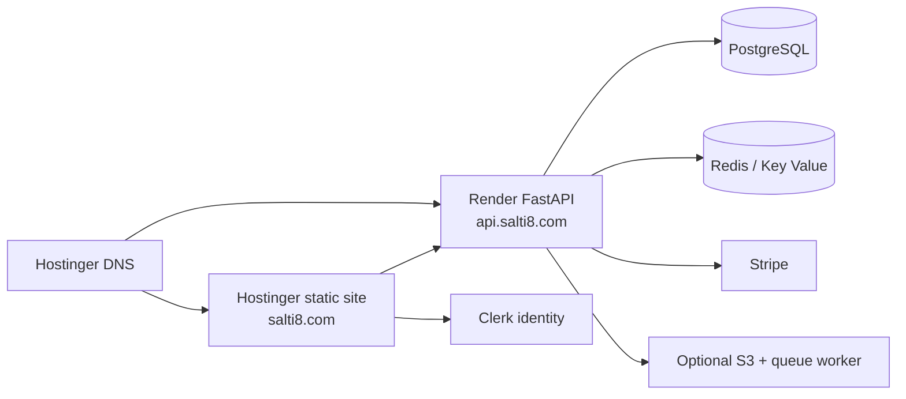

# SALTI8 sale-ready launch action plan

**Updated:** July 28, 2026
**Repository:** `robs46859-eng/layer8`
**Release branch:** `main`
**Canonical site:** `https://salti8.com`
**API:** `https://api.salti8.com`

## Architecture decision

Use Hostinger for authoritative DNS, TLS, CDN, and the statically exported
website. Use Render for the FastAPI control plane. Use Clerk for browser
identity and organizations. Use Stripe for Checkout, subscriptions, the
customer portal, and signed webhooks.



Do not run a persistent Next.js server on Hostinger. The confirmed Node
worker-thread crash occurs before the application starts and cannot be fixed
with Clerk or Stripe variables.

## Current verified state

- [x] `salti8.com` DNS is controlled in Hostinger.
- [x] `api.salti8.com` resolves to the existing Render service.
- [x] API `/healthz` returns `200`.
- [x] PostgreSQL migrations are applied through revision `20260728_0006`.
- [x] Stripe webhook endpoint is configured and rejects unsigned requests.
- [x] CORS allows `salti8.com` and rejects unrelated origins.
- [x] Public pilot/contact intake API exists.
- [x] Team and Business billing paths exist and entitlements are webhook-driven.
- [ ] API `/readyz` returns `200`; Redis, object storage, and queue are not all configured.
- [ ] Hostinger serves the current static `out` build on both apex and `www`.
- [ ] Clerk production sign-in and organization selection pass.
- [ ] Stripe test Checkout, webhook activation, cancellation, and portal pass end to end.
- [ ] Always-on production API and recoverable database plans are approved.

## Gate 1 — Repository release

- [ ] `npm ci`, type check, static build, and dependency audit pass.
- [ ] Every sitemap URL exists in `apps/web/out`.
- [ ] Public pages have canonical metadata and one `h1`.
- [ ] Auth and billing pages are `noindex`.
- [ ] Ruff, full pytest, and a blank-database migration rehearsal pass.
- [ ] No secret or local build output is staged.
- [ ] One reviewed commit is pushed to `main`.

## Gate 2 — Hostinger static site

Configure the existing Hostinger website:

```text
Framework: Other / Static
Root directory: apps/web
Install: npm ci
Build: npm run build
Output: out
Start command: none
```

Add only:

```text
NEXT_PUBLIC_CLERK_PUBLISHABLE_KEY
NEXT_PUBLIC_API_URL=https://api.salti8.com
NEXT_PUBLIC_TEAM_PRICE_LABEL=$99/mo
NEXT_PUBLIC_BUSINESS_PRICE_LABEL=$299/mo
```

Verify apex, `www`, pricing, pilot, legal, sign-in, billing, robots, and sitemap.
Set one permanent `www` → apex redirect.

## Gate 3 — Render API

The existing free Docker service is useful for integration testing but is not
an acceptable paid-customer target because it can sleep and currently reports
dependency failure.

Before taking a production payment:

1. Add a managed Redis/Key Value connection.
2. Either configure S3 + queue + worker, or explicitly disable those optional
   archive features and describe the reduced retention scope in the customer
   order.
3. Upgrade the API to an always-on paid instance.
4. Use a paid, backed-up PostgreSQL plan.
5. Set `DEFAULT_PROVIDER=mock` until an approved provider key is entered.
6. Confirm `/readyz`, authenticated inference, timeout behavior, and audit
   persistence.

Do not apply `render.yaml` blindly to the existing project; it creates a full
paid service set. Review the monthly total before applying or migrate the
existing service deliberately.

## Gate 4 — Clerk

1. Use the production Clerk instance for the live site.
2. Enable Organizations.
3. Set sign-in URL to `https://salti8.com/sign-in/`.
4. Set sign-up URL to `https://salti8.com/sign-up/`.
5. Set the post-auth destination to `https://salti8.com/app/billing/`.
6. Put only the publishable key in Hostinger.
7. Put JWT public key, issuer, and authorized parties in Render.
8. Verify a missing token, wrong audience, and wrong organization all fail.

## Gate 5 — Stripe

Live catalog:

```text
SALTI8 Team — $99/month
SALTI8 Business — $299/month
Tax category: AI as a Service, cloud based, business use
```

Required webhook URL:

```text
https://api.salti8.com/v1/webhooks/stripe
```

Required events:

```text
checkout.session.completed
checkout.session.async_payment_succeeded
checkout.session.async_payment_failed
customer.subscription.created
customer.subscription.updated
customer.subscription.deleted
customer.subscription.trial_will_end
invoice.paid
invoice.payment_failed
invoice.payment_action_required
entitlements.active_entitlement_summary.updated
```

Create a customer-portal configuration that allows payment-method updates,
invoice history, and cancellation at period end. Run test mode first. A
browser success redirect never grants access; only the signed webhook does.

## Gate 6 — First customer

1. Qualify one narrow 30-day pilot.
2. Create the customer's Clerk organization.
3. Map that organization ID to one Layer8 tenant.
4. Invite one accountable customer administrator.
5. Run a test subscription and revoke it.
6. Run the live subscription only after the test passes.
7. Deliver the API key through a secure secret-sharing channel.
8. Hold a kickoff covering provider credentials, data handling, retention,
   acceptance metrics, escalation, and cancellation.

## Definition of sale ready

SALTI8 is sale ready only when all six gates pass and a new organization can
move from sign-up to active entitlements without a manual database edit. A
green build, an HTTP `200` homepage, or a Stripe Checkout redirect alone is
not sufficient.
