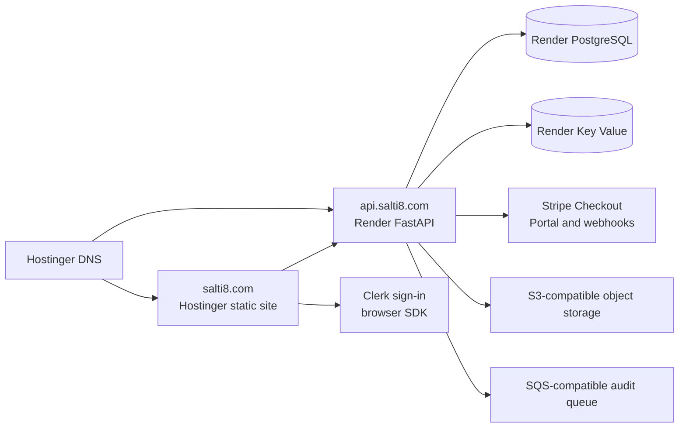

# SALTI8 launch recovery and billing activation plan

**Status:** Approved architecture proposal; implementation has not resumed  
**Prepared:** July 28, 2026  
**Repository:** `robs46859-eng/layer8` on `main`  
**Public domain:** `salti8.com`  
**DNS authority:** Hostinger  

## 1. Current state and confirmed failure

The July 28 Hostinger deployments are **not successful production releases**,
even though hPanel labels the latest build `Completed` and the application
`Running`.

Confirmed evidence:

- `https://salti8.com/`, `/sign-in`, `/app/billing`, `/robots.txt`,
  `/sitemap.xml`, `/ai-gateway`, and `/pricing` return HTTP `503`.
- Hostinger builds the Next.js project and copies a server artifact into the
  deployed `nodejs` directory.
- The deployed `nodejs/stderr.log` shows Node 22 aborting before application
  code starts:

  ```text
  Assertion failed: (0) == (uv_thread_create(...))
  node::WorkerThreadsTaskRunner::DelayedTaskScheduler::Start()
  ```

- Adding Clerk variables would not fix this failure. Node cannot create its
  runtime worker thread, so the SALTI8 process never reaches Clerk, Stripe, or
  application initialization.
- Changing from Next.js 16 to Next.js 15 did not fix the failure.

### Root cause

The incorrect configuration is the **deployment boundary**, not the SALTI8
page code. The marketing site is configured as a persistent server-side
Next.js process on Hostinger shared Web Apps hosting. That process aborts in
the host runtime before SALTI8 starts.

The current design also puts a small server-side billing bridge inside the
frontend merely to relay requests to FastAPI. That bridge forces the whole
public site to require a working Node server even though all billing
authorization and Stripe secrets already belong in the FastAPI service.

## 2. Architecture decision

Use Hostinger for DNS, SSL, CDN, and the statically generated SALTI8 frontend.
Do not run a persistent Next.js process on Hostinger.

Run the FastAPI API, Stripe webhook, PostgreSQL, Redis, and background worker
on a service designed for long-running application processes. The launch
target is Render because it provides a direct path for the existing FastAPI
container, PostgreSQL, Redis-compatible Key Value, logs, health checks, and
GitHub deployments without requiring a Kubernetes cluster for the first
customer.



### Why this is the launch configuration

- Public SEO pages remain statically generated with complete initial HTML.
- Hostinger serves files without starting Node, eliminating the confirmed
  worker-thread crash.
- Clerk sign-in runs in the browser. FastAPI validates every Clerk session
  token and organization claim; the browser is never trusted for
  authorization.
- The browser calls the existing customer billing endpoints directly.
- Stripe secret keys and the webhook secret remain only in the API
  environment.
- `salti8.com` and `api.salti8.com` remain under Hostinger DNS control.
- Kubernetes remains a later scale target, not a first-customer prerequisite.

## 3. Implementation sequence

Do not redeploy after individual steps. Complete Gates A through D, then make
one controlled public release.

### Phase 0 — Freeze and restore a clean base

**Codex**

1. Keep Hostinger automatic deployment disabled while recovery work is in
   progress.
2. Revert the Next.js 15 compatibility experiment from commit `9e1af7c`.
   It did not address the failure and introduced dependency advisories.
3. Retain all SALTI8 design, SEO, image, Clerk, FastAPI, and Stripe work.
4. Record the failed Hostinger server deployment as a superseded architecture,
   not as a rollback target.

**Gate A**

- Working tree is clean.
- CI passes.
- No credentials exist in Git history or tracked files.

### Phase 1 — Produce a static Hostinger frontend

**Codex**

1. Configure `apps/web/next.config.ts` with `output: "export"` and
   `trailingSlash: true`.
2. Restore Next.js 16 and use its supported static-export configuration.
3. Remove the Next middleware/proxy runtime requirement.
4. Remove the three frontend server routes under `apps/web/app/api/billing`.
5. Keep `/sign-in`, `/app/billing`, and `/billing/success` as static,
   `noindex` client pages.
6. Change the billing dashboard to:
   - obtain a Clerk session token in the browser;
   - send it as `Authorization: Bearer <token>`;
   - call `NEXT_PUBLIC_API_URL` directly;
   - redirect only to Stripe URLs returned by the API.
7. Protect the billing screen in the client with Clerk signed-in and active
   organization checks. Treat this only as a user-interface guard; FastAPI is
   the enforcement point.
8. Preserve static generation for all public SEO pages, canonical metadata,
   structured data, `robots.txt`, and `sitemap.xml`.
9. Make the Hostinger artifact the generated `apps/web/out` directory.

**Hostinger build settings**

```text
Application type: Static / front-end application
Root directory: apps/web
Node version: 22
Build command: npm run build
Output directory: out
Persistent Node entry file: none
```

**Gate B**

- `npm run check` passes.
- `npm run build` produces `apps/web/out/index.html`.
- Every public route has meaningful HTML in `out`.
- No generated page requires a server function, middleware, or Next API route.
- A plain static file server returns `200` for home, pricing, all SEO routes,
  sign-in, billing, robots, and sitemap.
- Authenticated pages contain `noindex`.

### Phase 2 — Deploy the API and sandbox infrastructure

**Codex**

1. Add a Render Blueprint for:
   - one FastAPI web service;
   - one worker service;
   - managed PostgreSQL;
   - managed Redis-compatible Key Value.
2. Run Alembic migrations as the release/pre-deploy command.
3. Configure `/healthz` as the health check.
4. Allow CORS only from:

   ```text
   http://localhost:3000
   https://salti8.com
   https://www.salti8.com
   ```

5. Keep the mock AI provider as the sandbox default.
6. Connect the existing S3-compatible and SQS-compatible services before
   enabling durable audit jobs. If those services are not ready, disable
   affected asynchronous features explicitly; do not silently drop audit
   records.

**Robert — enter API secrets in Render, not Hostinger**

```text
ENVIRONMENT=staging
PUBLIC_WEB_URL=https://salti8.com
DATABASE_URL=<Render PostgreSQL internal URL>
REDIS_URL=<Render Key Value internal URL>

CLERK_JWT_KEY=<Clerk PEM public key>
CLERK_ISSUER=<Clerk development issuer>
CLERK_AUTHORIZED_PARTIES=https://salti8.com,https://www.salti8.com

STRIPE_SECRET_KEY=sk_test_...
STRIPE_WEBHOOK_SECRET=whsec_...
STRIPE_LIVE_MODE=false
STRIPE_PRICE_TEAM_MONTHLY=price_...
STRIPE_PRICE_BUSINESS_MONTHLY=price_...
STRIPE_PORTAL_CONFIGURATION_ID=bpc_...

ADMIN_API_TOKEN=<generated high-entropy secret>
S3_ENDPOINT=<provider endpoint>
S3_BUCKET=<sandbox bucket>
S3_ACCESS_KEY_ID=<secret>
S3_SECRET_ACCESS_KEY=<secret>
AUDIT_QUEUE_URL=<sandbox queue URL>
```

Do not enter Stripe secrets, the Clerk JWT key, database credentials, provider
keys, or the admin token into Hostinger frontend variables.

**Gate C**

- Render reports healthy API and worker services.
- Alembic migrations complete.
- `https://<render-host>/healthz` returns `200`.
- A valid Clerk development token succeeds.
- A missing, expired, or wrong-organization token fails.
- Stripe test checkout, portal, and webhook tests pass.

### Phase 3 — Configure Hostinger DNS

Hostinger remains the authoritative DNS provider. The records are changed in
Hostinger hPanel under the DNS Zone Editor.

**Robert and Codex**

| Type | Name | Value | TTL | Action |
|---|---|---|---:|---|
| Hostinger site records | `@` | Current Hostinger static-site target | Default | Keep |
| CNAME or redirect | `www` | `salti8.com` or Hostinger-provided target | 300 | Set one canonical host |
| CNAME | `api` | Render service hostname supplied after API creation | 300 | Add |

Rules:

- Do not guess the Render target before the service exists.
- Remove any conflicting `api` A, AAAA, or CNAME record before adding the
  final record.
- Do not point `api.salti8.com` at the Hostinger frontend.
- Configure `https://salti8.com` as canonical and permanently redirect
  `www` to it.
- Add `api.salti8.com` as a custom domain in Render so Render can issue TLS.

**Gate D**

- `dig api.salti8.com` resolves to the expected Render target.
- `https://api.salti8.com/healthz` returns `200` with a valid certificate.
- CORS accepts `salti8.com` and rejects an unrelated origin.

### Phase 4 — Activate Clerk in the Hostinger static build

**Robert — enter only these variables in Hostinger**

```text
NEXT_PUBLIC_CLERK_PUBLISHABLE_KEY=pk_test_...
NEXT_PUBLIC_API_URL=https://api.salti8.com
```

These values are embedded at build time, so changing either requires a new
static build.

Do **not** enter `CLERK_SECRET_KEY` in Hostinger. The static frontend does not
need it. The API validates Clerk JWTs with `CLERK_JWT_KEY`.

**Clerk dashboard**

1. Enable Organizations.
2. Keep signup invitation-only for the pilot.
3. Add `https://salti8.com/sign-in` as the sign-in URL.
4. Add `https://salti8.com/app/billing` as the post-sign-in URL.
5. Allow `salti8.com` in the development instance while sandbox testing.

**Gate E**

- A signed-out visitor can view public pages.
- `/sign-in` renders Clerk.
- A signed-in user with no organization cannot access customer billing data.
- A signed-in organization member can load only that organization's billing
  account.
- Direct API requests without a valid Clerk token are rejected.

### Phase 5 — Complete Stripe sandbox wiring

**Stripe webhook URL**

```text
https://api.salti8.com/v1/webhooks/stripe
```

**Required event listeners**

```text
checkout.session.completed
checkout.session.async_payment_succeeded
checkout.session.async_payment_failed
customer.subscription.created
customer.subscription.updated
customer.subscription.deleted
customer.subscription.trial_will_end
invoice.paid
invoice.payment_failed
invoice.payment_action_required
entitlements.active_entitlement_summary.updated
```

`checkout.session.completed` alone is insufficient for renewals,
cancellations, failed payments, delayed payment methods, trials, and
entitlement changes.

**Gate F**

1. Create a Clerk Organization and its Layer8 tenant mapping.
2. Start Team test checkout from `/app/billing`.
3. Complete checkout with a Stripe test card.
4. Confirm the signed webhook, not the browser redirect, changes the tenant to
   active.
5. Confirm the correct entitlements are granted.
6. Open the Stripe customer portal.
7. Cancel the test subscription and confirm the webhook updates access
   according to the configured period-end policy.
8. Replay one event and confirm idempotency.

### Phase 6 — One controlled public release

1. Re-enable Hostinger automatic deployment only after Gates A through F pass.
2. Deploy the static frontend once.
3. Clear Hostinger CDN cache.
4. Verify with cache-busting requests:

   ```text
   / 
   /pricing/
   /sign-in/
   /app/billing/
   /robots.txt
   /sitemap.xml
   /ai-gateway/
   ```

5. Run mobile and desktop visual checks.
6. Confirm all public pages return `200`, billing redirects correctly, and
   authenticated pages remain `noindex`.
7. Submit the sitemap to Google Search Console and Bing Webmaster Tools only
   after the production checks pass.

## 4. First-customer activation

Do not sell a platform-wide transformation first. Recruit one design partner
with one expensive AI failure mode and a single accountable owner.

1. Target 20 AI consultancies, managed service providers, or B2B SaaS teams
   already operating more than one AI model.
2. Offer three paid design-partner slots.
3. Sell a 30-day pilot around one workflow:
   - current failure and cost baseline;
   - Layer8 routing/validation policy;
   - human approval rule;
   - audit and provenance output;
   - agreed acceptance metric.
4. Onboard the first customer through a Clerk Organization and invitation.
5. Run Stripe Checkout rather than taking payment manually.
6. Review results weekly and request a case study only after the customer has
   verifiable evidence.

## 5. Stop conditions

Stop the release and do not label the site live if any of the following is
true:

- any required public route returns `5xx`;
- Hostinger is still configured to start a persistent Node process;
- `api.salti8.com` lacks DNS or TLS;
- Clerk organization authorization has not been tested;
- Stripe webhook signature verification is not active;
- billing activation depends on the success redirect instead of a webhook;
- a frontend environment contains a Stripe, Clerk, database, provider, or
  admin secret;
- CI, type checks, tests, migrations, or the static production build fail.

## 6. Definition of “live”

SALTI8 is live only when all of these are true:

- public routes return `200` from Hostinger static hosting;
- Clerk sign-in works at `salti8.com`;
- the API is healthy at `api.salti8.com`;
- an organization member can complete Stripe test checkout;
- signed webhooks update billing and entitlements;
- the customer portal works;
- direct unauthenticated API access is rejected;
- SEO metadata, sitemap, robots, and canonical URLs pass production checks.

